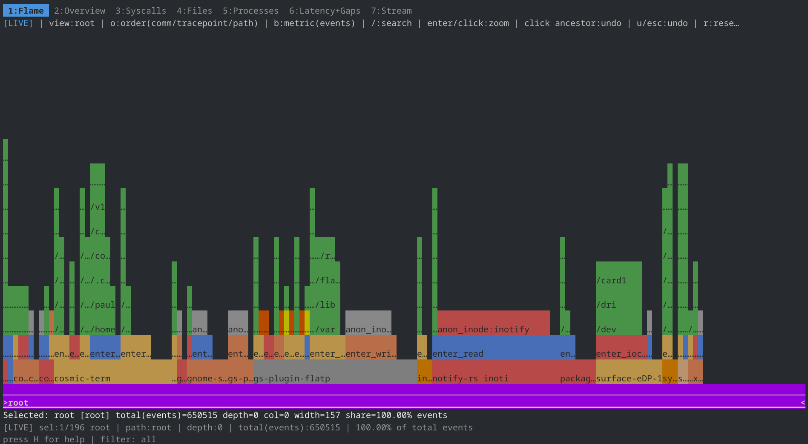
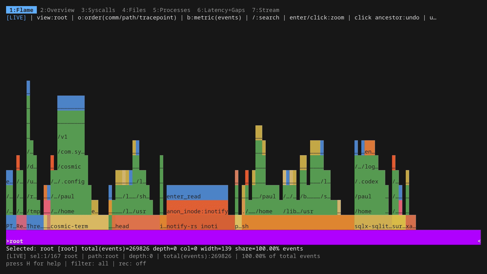

# I/O Riot NG (`ior`)


`ior` traces Linux syscalls with eBPF and shows their timing, counts, paths and processes in
a terminal dashboard. It can also write a collapsed `.ior.zst` recording, Parquet rows or
plain CSV. By default it attaches only filesystem syscalls; other families are opt-in.

This is the Go, C and eBPF successor to [I/O Riot](https://codeberg.org/snonux/ioriot),
which used SystemTap. The
[blog series](https://foo.zone/gemfeed/2026-05-08-unveiling-ior-ng-part-1.html) covers the
project history.



## Build

`ior` runs on Linux/amd64 and needs a host kernel with BTF at `/sys/kernel/btf/vmlinux`.
The Docker build also reads the host's tracepoints, so build it on a Linux host with the
syscalls you want to include. Tracepoints absent on a target host are skipped when `ior`
attaches.

With Docker, build directly from the checkout:

```sh
./scripts/build-with-docker.sh
```

That writes `./ior`. Later builds can reuse the image with
`./scripts/build-with-docker.sh --run`. If you have [Mage](https://magefile.org) installed,
`mage buildDocker` runs the same container build. `mage buildDockerEl8` writes `ior.el8` for
RHEL/Rocky/Alma 8 hosts.

For native builds, install the Go version in `go.mod`, place `libbpfgo` at `../libbpfgo`
(or set `LIBBPFGO`), and follow
[the Rocky Linux 9 build guide](./docs/build-rocky-linux-9.md). [AGENTS.md](./AGENTS.md)
lists the build and test targets.

The binary statically links its userspace libraries and embeds a CO-RE BPF object. CO-RE
adjusts supported kernel field offsets using the target's BTF; it does not add syscalls or
BPF features to an older kernel.

## Run

```sh
sudo ./ior
```

The PID picker opens first. Choose a process, or press `Enter` on **All PIDs**. The
dashboard starts on the live flamegraph tab. Use `tab` / `shift+tab` or `1`–`7` to change
tabs; press `H` for help.




The [tutorial](./docs/tutorial/tutorial.md) shows all seven tabs and their keys. Its GIFs
come from VHS tapes; `mage demo` rebuilds them after `mage installDemoTools` and `sudo -v`
on a Fedora/RHEL-family host.

### Choose syscalls

Without selection flags, only the **FS** family is attached. Choose families, kinds or names
explicitly when you need more:

```sh
sudo ./ior -trace-families Time,Polling
sudo ./ior -trace-kinds fd,open -no-trace-syscalls read
sudo ./ior -trace-syscalls openat,recvmsg,nanosleep -no-trace-kinds null
```

`./ior -help` lists the valid values. [Syscall tracing](./docs/syscall-tracing-plan.md)
explains classification and sampling.

In the TUI you can change the traced set at runtime: press `o` for the probes modal (on the
Flame tab, the default, `o` cycles the frame order, so press `O` there; `O` works on every
tab), `tab` to switch to the Families view (attached/total probes per family), and `space`
to attach the selected family, or detach it if any of its probes is attached. The Syscalls
view toggles single probes. Runtime changes survive trace restarts (PID/TID reselect,
filter changes), and newly attached syscalls get the same sampling rates as at startup. The
carried set is what you asked for: normally exactly what is attached, but a change that finishes
after the trace restarted keeps its intended set, whose unattachable probes are retried and
skipped with a log line until your next probe change. Detaching everything makes later
sessions attach nothing; only restarting `ior` returns to the `-trace-*` startup selection. `[`/`]`
only scope the view to a family; on a family with no attached probe the status line says
how to attach it.

### Save output

| Mode | Command or key | Output |
|---|---|---|
| TUI CSV snapshot | `e` | Current filtered stream snapshot in `ior-stream-<timestamp>.csv`. `e` always snapshots the live ring, even while the stream is paused (its modal says so); on the paused Stream tab `x`/`X` write the frozen paused rows |
| TUI Parquet recording | `R` to start and stop | Rows captured while recording |
| Native aggregate | `sudo ./ior -flamegraph -name run` | `<host>-run-<timestamp>.ior.zst` in the working directory at shutdown; `-name` is a base name (no `/`) |
| Headless Parquet | `sudo ./ior -parquet trace.parquet` | Per-event rows written during the run |
| Plain CSV | `sudo ./ior -plain -duration 5 > events.csv` | Per-event CSV on stdout; status on stderr |

Headless `-flamegraph` and `-parquet` check that their output can be written before tracing starts, so a mistyped directory fails immediately rather than after the run. If the working directory's filesystem rejects `:` (vfat, exFAT, some SMB shares), the `.ior.zst` timestamp uses `-` instead (`15-04-05`); if it rejects other characters of the `-name` (`? * " < > |`, non-ASCII text or raw non-UTF-8 bytes, which some `iocharset`/`utf8only`/case-folded filesystems refuse), `ior` refuses to start and says so.

A headless run scoped with `-pid N` (`-plain`, `-flamegraph`, `-parquet`) ends when process N exits, like `strace -p`: ior prints `Traced process N exited, stopping the trace`, then shuts down normally (statistics, recording published, exit status 0) instead of idling until `-duration` and possibly tracing whatever process is handed the recycled pid. It notices the exit from the kernel's process-exit event and, as a fallback that also covers a target dying while ior is still attaching its probes, by checking every 500 ms that the process is still the original one (a reused pid counts as exited). Children the target forked keep running untraced, since ior does not follow forks. The TUI keeps its session open after its target exits.

A headless run scoped with `-tid T` ends when thread T exits, even while the rest of its process runs on: ior prints `Traced thread T exited, stopping the trace` and shuts down the same way. For the main thread (`-tid` equal to the pid) that is when the main thread itself exits (for example `pthread_exit` in `main`), not when its last sibling does. One exception: when another thread of the process calls `execve`, the kernel gives the main thread's id to the new program, which ior keeps tracing under `-tid T` until it exits. A non-main thread T that calls `execve` continues under the process id, which `-tid T` no longer matches, so that run ends. With both `-pid P -tid T` the run follows the thread; the 500 ms fallback check covers the thread too (a reused thread id counts as exited).

The TUI keeps its statistics in memory until you export or start a recording.
`-tuiExport=false` disables CSV export shortcuts; it does not disable `R` recording. The
plain CSV schema is deliberately small:
`durationToPrevNs,durationNs,comm,pid.tid,name,ret,file`. Use TUI CSV export or Parquet for
timestamps, byte counts and other per-event fields. A row without a file shows the display
placeholder `N:file` in the `file` column of `-plain` output; TUI CSV export, Parquet and the
`.ior.zst` record store an empty file for it instead. `.ior.zst` recordings made before this
change still hold `N:file` as a real path frame (no format version bump; the format is unchanged).

Files are written to a temporary `ior-<random>.tmp` file and renamed into place when
complete. Names ior generates itself (`ior-stream-<timestamp>.csv`,
`ior-recording-<timestamp>.parquet`, `ior-snapshot-<timestamp>.csv`, and the
`<host>-<name>-<timestamp>.ior.zst` flamegraph record) are only accurate to the second and are
never overwritten: if the name is taken, ior writes `<name>-1.<ext>` (then `-2`, ...) and
prints or shows the path it really used (a very long name is shortened to fit the 255-byte
file name limit). A file name you choose yourself (`-parquet trace.parquet`, or a name typed
into a TUI export/recording prompt) is replaced if it exists, keeping that file's permissions
(and, when ior may set it, owner); a symlink at that name is replaced, not written through.
The TUI treats a name as generated only when it matches the generated pattern exactly
(zero-padded date and time, right extension); a hand-typed near miss such as
`ior-stream-20260930-90500.csv` or a missing `.csv`/`.parquet` counts as your own name and is
replaced. A typed name may carry a directory (`/tmp/x.csv`, `out/x.csv`, `../x.csv`): the stream
export honours it as typed, relative to the current directory unless absolute, and the Stream
tab shows the path it wrote. ior does not create missing directories. An empty name, a
name that denotes a directory (`out/`, `out/.`), a name over 255 bytes, a NUL byte, or a missing
or unwritable directory is refused with the reason shown in the `X` prompt, which stays open
with your text and cursor so you can fix it. The name is cleaned as text, not through symlinks:
`link/../x.csv` means `x.csv` next to `link`, even when `link` points elsewhere. A killed ior can leave an
orphaned `ior-*.tmp` behind; `mage mrproper` removes `*.tmp`.

With an explicit sampling rate, a raw-mode run (`-plain`, `-flamegraph`, `-parquet`) writes only a
sample of the sampled syscalls. It says so on stderr at startup, reports their exact totals
(rows written plus the invocations the kernel only counted) in the end-of-run statistics, and
marks the files: Parquet footer keys `ior.sampling` and `ior.sampling.totals` (see
`docs/parquet-querying.md`), and the `.ior.zst` header (format version 2, which `ior collapsed`
reports on stderr; unsampled recordings keep version 1). Totals are reported as unavailable
under a filter the kernel counters cannot apply (`-comm`, `-path`, ...). If the kernel's ring
buffer dropped events (`ring buffer drops: N` in the statistics) or records still buffered at
stop could not be decoded (`records discarded at stop: N`), the lost rows are in neither
count, so the totals are labelled `at least` (Parquet: `"lower_bound":true`) instead of exact.
A family rate (`-syscall-sampling-families FS=10`) is reported once as `FS=10`, with lines and
totals only for the syscalls that were invoked; syscalls whose probes are not attached are not
reported.

`-flamegraph` writes an aggregated native record, not an SVG. To render it with external
FlameGraph tools, run `ior collapsed <file>.ior.zst | flamegraph.pl > flame.svg`.
Records whose selected `-fields` are all empty (for example an empty file name with
`-fields path`) are counted under a `[unknown]` frame so the total weight is preserved (the
event count with the default `-count count`, otherwise the sum of that counter); zero-weight
records are omitted.

A recording stores tracepoint names (`enter_openat`), not the build-specific numeric IDs, so
it stays readable across ior releases and is translated to the reading build's IDs. A
recording that names a tracepoint the reading build does not know is refused, as is one
written before recordings carried names (no format header): its numbers cannot be mapped
reliably, so re-record it instead of trusting a silently wrong syscall name.

Traced comm names and paths come from other users and may contain terminal escape
The recording is bounded in memory: it keeps about 2^19 (524288) distinct
(path, comm, pid, tid, flags) records, plus a cap/8 headroom for pid/tid-folded records
and a handful of `[other]` records, which an ordinary trace never reaches but a
fork-heavy system-wide run can. Past that, events of new pid/tid combinations are folded
into a pid 0/tid 0 record of the same path and comm, and, if the path/comm population
churns as well, into `[other]` records. Counts, durations and bytes stay exact; only the
detail of the folded events is lost, which the default collapsed fields (`comm,tracepoint,path`)
barely notice for pid/tid churn. ior warns on stderr when the limit is first hit and
prints the number of folded events after `Wrote <file>`. `-flamegraph-max-keys N` sets the
limit (1 to 16777216, default 524288); each record costs about 250 bytes of memory while
recording, plus up to ~500 bytes more transiently while the file is written at the end (the
records are serialized and buffered in full before compression). So the default needs ~130 MB
while tracing and ~400 MB at the peak, the maximum ~4 GB and ~12 GB, plus 1/8 headroom on top.
Raise it when the warning appears and the pid/tid detail matters; lower it on a
memory-constrained host.

sequences. When `-plain` or `ior collapsed` writes to a terminal, control characters
(ESC, BEL, C1, line breaks), invalid UTF-8 bytes and invisible, bidi format or blank-rendering space characters (no-break space,
ideographic space, Braille blank, ...) are shown in Go escape notation such as `\x1b` or `\u202e`; the CSV stays valid.
Backslashes are not doubled, so this display is for reading only. When stdout is piped or
redirected, both commands write the exact traced bytes for machine consumers, with one
exception: `ior collapsed` always writes a line feed or carriage return inside a frame as
`\x0a` or `\x0d`, because the collapsed format is one `frame;frame count` stack per line and
a raw line break in a traced path would forge an extra weighted stack. A `;` in a traced
name splits it into frames exactly as the TUI flamegraph does.

That terminal check is `-escape=auto`, the default. It cannot see a terminal at the end
of a pipe, so `ior -plain | grep`, `| tee` or `| less -R` (and `ior collapsed ... | less -R`)
still show raw bytes. Use `-escape=always` for such pipelines, or `-escape=never` to keep
raw bytes on a terminal. Both `-plain` and `ior collapsed` accept the flag, and any other
value is an error.

## Troubleshooting

libbpf's own diagnostics are reduced to its warnings: in `-plain`, `-flamegraph` and
`-parquet` runs they go to stderr, in full (a failed BPF load is explained there). In the
TUI they appear as setup warnings when setup succeeds, and when the BPF load or attach
fails they are appended to the error screen under `Warnings logged during setup:`. A
rejected program is condensed there to one row: its name plus the last three lines of the
kernel verifier log (the offending instruction, the reason such as
`R1 invalid mem access 'scalar'`, and the `processed N insns` statistics) and a
`... (N more lines)` marker for the rest. Each row is cut to at most 512 bytes and only then
are its control characters shown escaped, so a row with many control or invalid bytes can
end up to about four times longer; at most 8 rows are listed (`... and N more warning(s)`
counts the others). The error screen fits the terminal at any size: text taller than the
terminal is cut with a `... (N more lines)` row and every line, the key hint included, is
wrapped or cut to the terminal width, so the key hint stays visible. For the complete
verifier log rerun the same options with `-plain` and
read stderr. The thousands of INFO/DEBUG lines libbpf prints while loading are
dropped by default. To see them in a headless run, for example when a BPF program fails to
load, set `IOR_LIBBPF_DEBUG=1` (`0`, `false`, `no` and `off` keep it off; the TUI ignores it
because its screen owns stderr):

```sh
sudo IOR_LIBBPF_DEBUG=1 ./ior -plain -duration 5 2> libbpf.log > /dev/null
```

`./ior -help` lists the variable too.

## Bytes Classification

Throughput bytes come from positive return values of these syscalls only
(exceptions: `recvfrom`/`recvmsg` count 0 bytes under `MSG_PEEK` and at most the buffer capacity
under `MSG_TRUNC`, see [Syscall tracing](./docs/syscall-tracing-plan.md)):

- `ReadClassified`: `fgetxattr`, `flistxattr`, `getcwd`, `getdents`,
  `getdents64`, `getrandom`, `getxattr`, `getxattrat`, `lgetxattr`,
  `listxattr`, `listxattrat`, `llistxattr`, `mq_timedreceive`, `msgrcv`,
  `pread64`, `preadv`, `preadv2`, `process_vm_readv`, `read`, `readlink`,
  `readlinkat`, `readv`, `recvfrom`, `recvmsg`, `sched_getaffinity`
- `WriteClassified`: `process_vm_writev`, `pwrite64`, `pwritev`, `pwritev2`,
  `sendmsg`, `sendto`, `write`, `writev`
- `TransferClassified`: `copy_file_range`, `sendfile64`, `splice`, `tee`,
  `vmsplice` (counted as both read and write bytes)
- Non-bytes: all remaining traced syscalls

[Syscall tracing](./docs/syscall-tracing-plan.md) lists every traced syscall by family and
kind and covers the exceptions, such as xattr size probes.
