# I/O Riot NG: a guided tour

This tour shows the dashboard, stream, recording and headless modes with short GIFs captured
from the program.

Every GIF in this document is regenerated from a [VHS](https://github.com/charmbracelet/vhs)
tape under [`tapes/`](./tapes). To rebuild them all, run `sudo -v && mage demo` (see
[Regenerating the demo](#regenerating-the-demo)).

## Contents

1. [Installing ior](#installing-ior)
2. [First launch: the PID picker](#first-launch-the-pid-picker)
3. [Touring the dashboard tabs](#touring-the-dashboard-tabs)
   - [1 · Flamegraph](#1--flamegraph-default-landing-tab)
   - [2 · Overview](#2--overview)
   - [3 · Syscalls](#3--syscalls)
   - [4 · Files](#4--files)
   - [5 · Processes](#5--processes)
   - [6 · Latency + Gaps](#6--latency--gaps)
   - [7 · Stream](#7--stream)
4. [Mastering the Stream tab](#mastering-the-stream-tab)
   - [Pause + stacked filters](#pause--stacked-filters)
   - [Regex search](#regex-search)
   - [CSV export](#csv-export)
5. [Choosing what to trace](#choosing-what-to-trace)
6. [Recording for offline analysis](#recording-for-offline-analysis)
   - [TUI Parquet recording](#tui-parquet-recording)
   - [Headless modes](#headless-modes)
7. [Regenerating the demo](#regenerating-the-demo)

## Installing ior

See the [main README](../../README.md) for build requirements. On a Docker-capable Linux
host with BTF and tracefs:

```shell
git clone https://codeberg.org/snonux/ior ~/git/ior
cd ~/git/ior
./scripts/build-with-docker.sh
```

For a native build, set up libbpfgo as described in the
[Rocky build guide](../build-rocky-linux-9.md):

```shell
mage all
```

The tracing examples use `sudo` because attaching BPF tracepoints needs elevated access on
the usual host setup.

The built binary embeds a CO-RE BPF object. It can be copied to compatible Linux/amd64 hosts
with BTF; missing tracepoints are skipped. See [the build notes](../../README.md#build).

## First launch: the PID picker

`sudo ./ior` starts with the **PID picker**. The cursor is on **All PIDs**, so pressing
`Enter` traces the whole system. Type into the filter box to narrow the list by PID, comm,
or cmdline; arrow keys move the selection.


The same picker can be re-opened later from the dashboard with `p`.

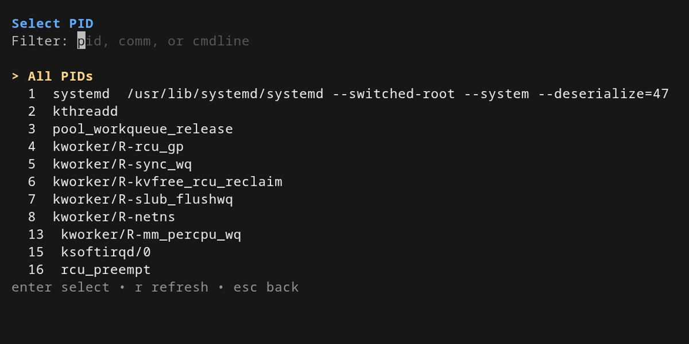

## Touring the dashboard tabs

The dashboard has seven tabs. The default landing tab is **Flamegraph**. Use the number keys
or `tab` / `shift+tab` to move between them. With no selection flags, ior attaches only the
FS syscall family.

| Key | Tab               | What it shows                                                            |
|-----|-------------------|--------------------------------------------------------------------------|
| `1` | Flamegraph (`Flm`)| Live FlameGraph of the configured stack (`comm`/`path`/`tracepoint`)     |
| `2` | Overview (`Ovr`)  | Sparkline + top syscalls + top paths summary                             |
| `3` | Syscalls (`Sys`)  | Sortable per-syscall counters, latency, byte volume                      |
| `4` | Files (`Fil`)     | Per-path counters; `d` toggles directory grouping                        |
| `5` | Processes (`Pro`) | Per-process / per-comm counters                                          |
| `6` | Latency (`Lat`)   | Latency + inter-syscall gap histograms                                   |
| `7` | Stream (`Str`)    | Live tail of individual traced events                                    |

### 1 · Flamegraph (default landing tab)

The first thing you see after dismissing the PID picker is the **live flamegraph**. Bars
grow as new events come in. `o` cycles the stack ordering (e.g. `comm/path/tracepoint` ↔
`comm/tracepoint/path`); `b` toggles the size metric (event count vs. bytes).


### 2 · Overview

Press `2` for a sparkline of recent event volume, top syscalls and top paths.

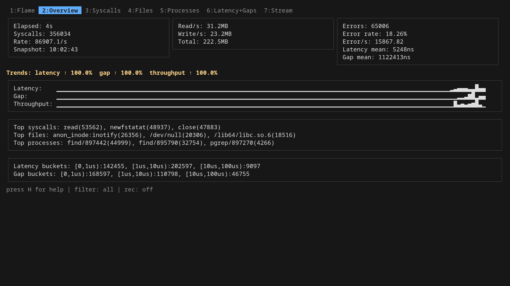

### 3 · Syscalls

Press `3`. A sortable table of every traced syscall (family, count, average latency, total
bytes). Each row carries a **Family** column that groups the syscall into a broad class (FS,
Network, Memory, Polling, …). `j` / `k` (or arrow keys) scroll the rows; `←` / `→` move the
selected column; `s` sorts by the selected column using its default direction; `S` reverses.

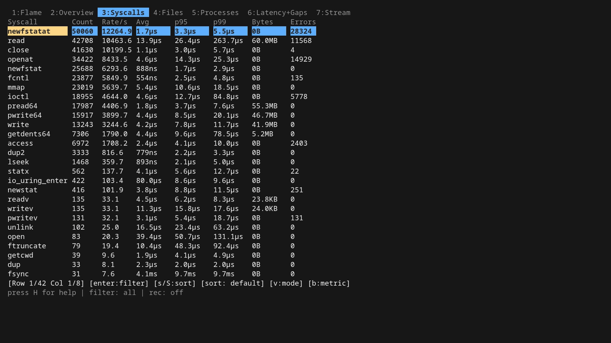

### 4 · Files

Press `4` for per-path counters. `d` toggles **directory grouping**, which rolls paths up to
their parent directory.

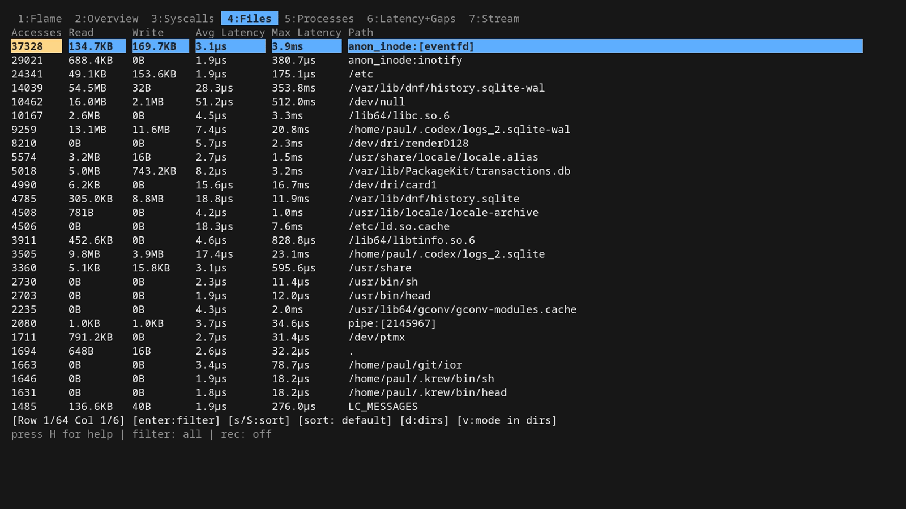

### 5 · Processes

Press `5`. Per-process / per-comm view. `S` reverse-sorts; combine with `←` / `→` to pick a
column.

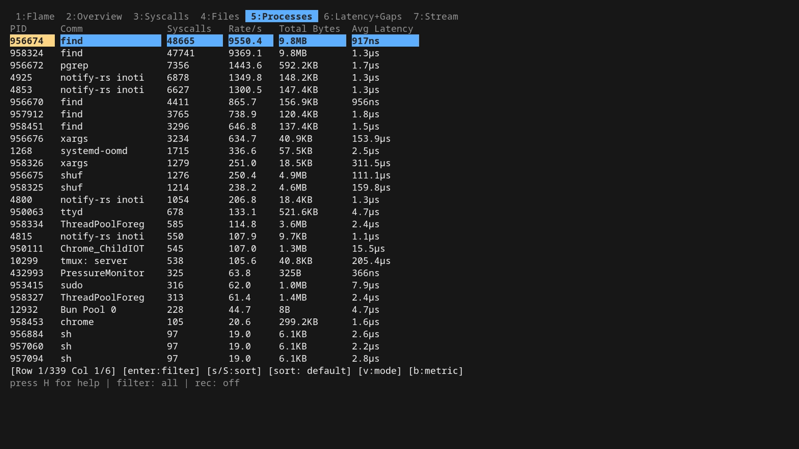

### 6 · Latency + Gaps

Press `6`. Two histograms: syscall **latency** (how long the syscall ran) and the
inter-syscall **gap** (idle time on the same thread between syscalls). The big-write
workload running in the background spreads the latency distribution noticeably.
The gap is measured between consecutive *traced* calls on a thread: with syscall sampling
(`-syscall-sampling-*` rate N), or for syscalls only counted in kernel aggregates (such as
futex), it spans the untraced calls in between. The Overview tab's `Traced gap` mean uses
the same samples.

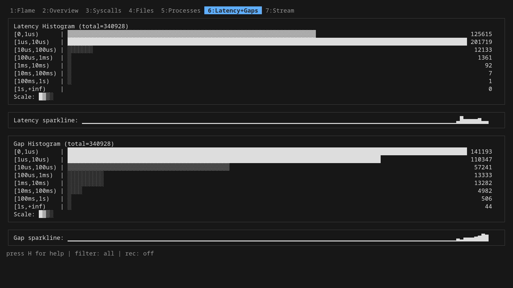

### 7 · Stream

Press `7` for a live tail of event rows: comm, PID, TID, syscall, file, FD, return value,
bytes, latency and gap.

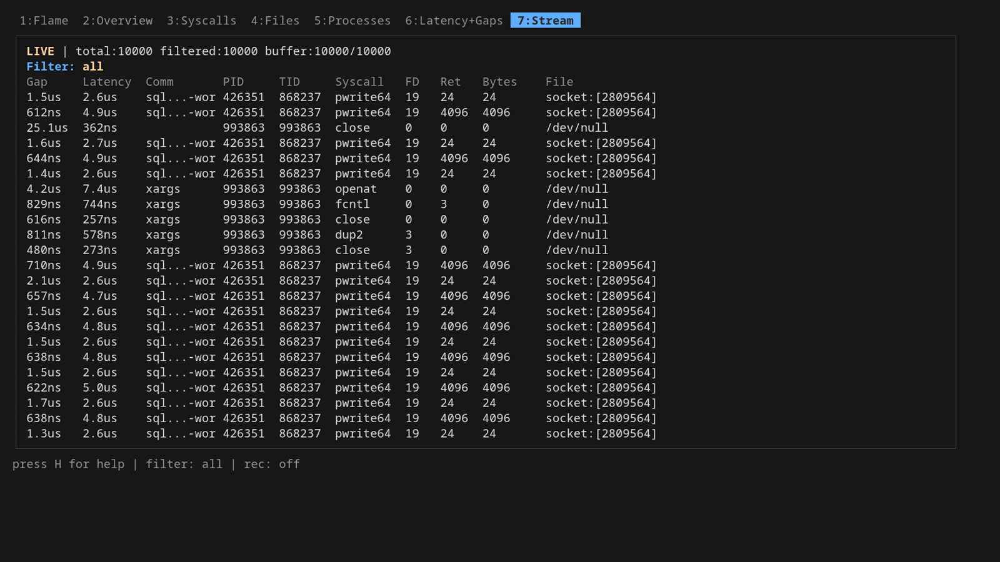

## Mastering the Stream tab

Stream has **Live** and **Pause** modes; `space` switches between them. Pause lets you
select cells and build filters.

### Pause + stacked filters

In pause mode, navigate with `j` / `k` (rows) and `←` / `→` (columns). Pressing `Enter` on
the selected cell **pushes a new filter onto a stack** and immediately re-filters the ring
buffer. A `Comm`, `Syscall` or `File` cell filters on exactly that value (`^value$`, case-sensitive), so
`read` does not also select `readv` or `READ`, and `/tmp/a` not `/tmp/ab`; numeric cells filter on
equality, and `Gap`/`Latency` on "at least this long". Filters are stackable, so you can
drill down: first by `Comm`, then by `Syscall`, then by `File`. `Esc` pops the most
recent filter (LIFO); keep hitting `Esc` to undo all the way back.

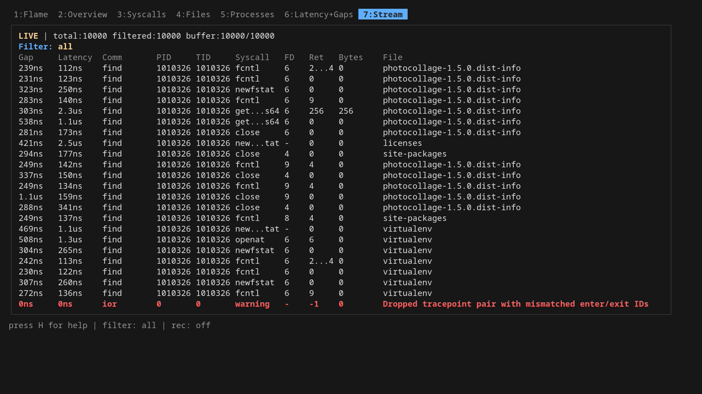

The filter is reflected in the bottom status line, and matches the same syntax you'd type by
hand: `comm~bash`, `syscall~openat`, `latency>=100000`, etc.

### Regex search

`/` opens a forward regex prompt; `?` opens a backward one. `n` jumps to the next match in
the same direction; `N` reverses. The search runs against every column on every row in the
ring buffer and wraps at the end.

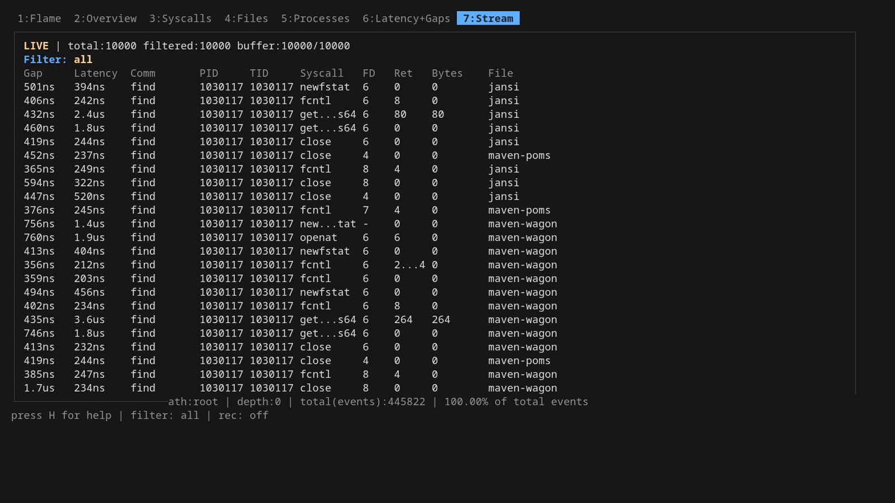

### CSV export

Four export keys are available:

- `e`: open the dashboard export picker, then write the **current TUI-filter snapshot** to `ior-stream-<timestamp>.csv` in the current working directory. Works from any tab.
- `x`: quick export of the **paused stream view** specifically (preserves your filter stack).
- `X`: same as `x`, but prompts for a filename first.
- `E`: open the most recent stream-exported CSV in your `$EDITOR` (`hx` / `vi` fallback).

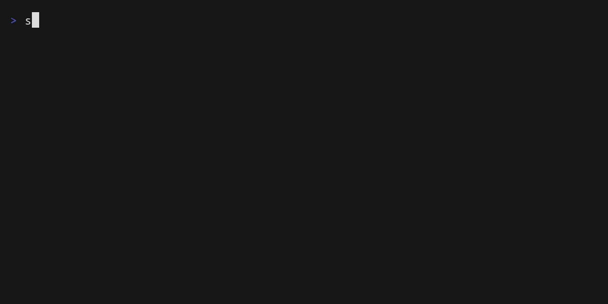

`-tuiExport=false` hides and disables those CSV export keys. It does not disable the `R`
Parquet recorder.

## Choosing what to trace

Three modal pickers reshape what the rest of the TUI sees:

- `p`: **PID picker** (re-opens the launch picker).
- `t`: **TID picker** for thread-level focus.
- `o`: **Probes** dialog: enable / disable individual syscall tracepoints. Press `tab` inside
  the dialog to switch between the **Syscalls** view (single probes: `space`/`enter` toggles,
  `a` all on, `n` all off, `/` search) and the **Families** view.


The **Families** view lists all 12 syscall families with attached/total probe counts
(`[x]` all attached, `[~]` some, `[ ]` none). `space` or `enter` detaches a family that has
any attached probe and attaches it otherwise, with a live `attaching <family>... n/total`
progress line while the batch runs; failures are reported (first error) without aborting
the rest. By default only the FS family is traced, so this is the way to start tracing
e.g. Network without restarting ior with `-trace-families`. Your runtime selection
persists across trace restarts (PID/TID reselect, filter changes), replacing the startup
`-trace-*` flags for the rest of the session. The `[` / `]` keys only re-scope the view to
a family; cycling onto one with no attached probe shows
`<Family> not traced: press o, tab, space to attach` in the status line.

Restricting to a single PID is also exposed as a CLI flag (`-pid <n>`), as is comm/path
filtering (`-comm`, `-path`). Tracepoint subsetting on the command line uses `-tps <regex>`
or `-tpsExclude <regex>`. Both take a comma-separated list of regexes; whitespace around
each regex and empty entries (for example a trailing comma) are ignored, and because the
comma is the separator a regex cannot itself contain one.

## Recording for offline analysis

Choose an output according to the detail you need:

| Flow                   | How                                          | What you get                                            |
|------------------------|----------------------------------------------|---------------------------------------------------------|
| TUI Parquet recording  | `R` from the dashboard                       | streaming Parquet of every row that passes your filter  |
| Headless `.ior.zst`    | `sudo ./ior -flamegraph -name <name>`        | one aggregated native recording at shutdown            |
| Headless Parquet       | `sudo ./ior -parquet trace.parquet`          | per-event Parquet rows written during the run          |
| Plain CSV              | `sudo ./ior -plain`                          | one CSV row per event on stdout (status lines on stderr) |

### TUI Parquet recording

Press `R` in the dashboard, accept the default filename
(`ior-recording-<timestamp>.parquet`) with `Enter`, and rows start streaming to disk. The
footer shows the active recording path (or the last error). Press `R` again to stop.

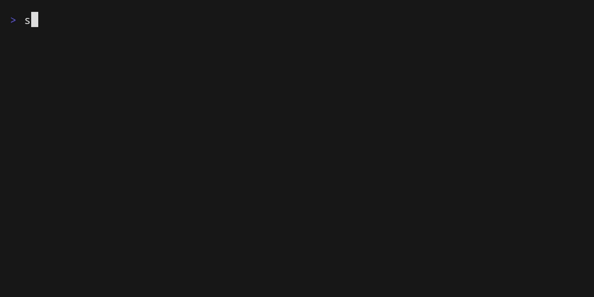

The recorder follows your *current* TUI global filter. Narrow with `p`, `t` or `o` first if
you want a focused capture.

### Headless modes

For unattended captures or scripting, skip the TUI entirely. The demo runs all three
back-to-back, capped with `-duration` so each terminates on its own.


`-flamegraph` writes one aggregated `.ior.zst` artifact at shutdown, ideal for `ior`'s
native flamegraph and integration workflows. To render a recording with external FlameGraph
tooling, derive collapsed stacks from it:
`ior collapsed <file>.ior.zst | flamegraph.pl > flame.svg`. `-parquet` streams every row,
so the file grows continuously. `-plain` is the lightest weight: CSV to stdout you can pipe
into anything (human-facing status lines go to stderr, so the pipe stays clean).

#### Plain CSV schema

`-plain` prints the header `durationToPrevNs,durationNs,comm,pid.tid,name,ret,file` once,
then one RFC 4180 CSV row per event. It is a reduced schema: there is no timestamp, byte
count, `requested_sleep_ns`, `nfds`, or `timeout_ns` column, and pid/tid share one
dot-separated column. Fields that may contain commas (process names, file paths) are
CSV-quoted, so parse the rows with any CSV reader rather than a naive comma split. For the
full per-event schema (with `seq`, `time_ns`, `bytes`, `error`, `family`,
`requested_sleep_ns`, `nfds`, `timeout_ns`, ...) use the TUI stream CSV export (`e` in
the dashboard, writes `ior-stream-<timestamp>.csv`) or headless Parquet instead.

## Regenerating the demo

The whole asset pipeline is reproducible:

```shell
mage installDemoTools          # one-time: VHS via go install + ttyd via dnf
sudo -v                        # warm the sudo timestamp once
mage demo                      # regen all 14 GIFs + screenshots (~10 min)
```

Or rebuild a single tape after editing it:

```shell
TAPE=07-stream-live mage demoOne
```

Tapes live in [`tapes/`](./tapes), the background workload that drives them is
[`scripts/workload.sh`](./scripts/workload.sh), and the resulting assets land in
[`assets/`](./assets). VHS records headlessly under `ttyd` + Chromium, so no real terminal
window opens; `mage demo` is safe to run in the background while you keep working.

## Hotkey Quick Reference

### Global keys

| Key | Action |
|-----|--------|
| `tab` / `shift+tab` | next / previous tab |
| `1`–`7` | jump to tab by number (1=Flame, 2=Overview, 3=Syscalls, 4=Files, 5=Processes, 6=Latency+Gaps, 7=Stream) |
| `H` | toggle global help overlay |
| `F1` | toggle bottom dashboard help bar |
| `e` | export filtered stream snapshot to CSV |
| `R` | start / stop Parquet recording |
| `p` | re-open PID picker |
| `t` | open TID picker |
| `o` | open probe selection dialog (`tab` there: Syscalls / Families view; `space`/`enter` toggles a whole family) |
| `r` | refresh dashboard snapshot |
| `q` / `ctrl+c` | quit |

### Tab-specific keys (`3:Syscalls`, `4:Files`, `5:Processes`)

| Key | Action |
|-----|--------|
| `s` | sort by selected column (default direction) |
| `S` | reverse-sort by selected column |
| `j`/`k` or `↑`/`↓` | scroll list |
| `d` (Files only) | toggle directory grouping |

### Stream tab (`7:Stream`)

| Key | Action |
|-----|--------|
| `space` | toggle live / pause mode |
| `g` / `G` | jump to top / tail |
| `j`/`k` or `↑`/`↓` | move row (pause) / scroll (live) |
| `←`/`→` or `h`/`l` | move selected column (pause only) |
| `enter` | push cell value as exact filter (pause) |
| `esc` | pop most recent filter (LIFO) |
| `c` | clear all stream filters |
| `f` | open advanced filter modal |
| `/` / `?` | regex search forward / backward |
| `n` / `N` | next / previous search match |
| `x` | quick CSV export of paused view |
| `X` | CSV export with filename prompt |
| `E` | open last CSV export in `$EDITOR` |
